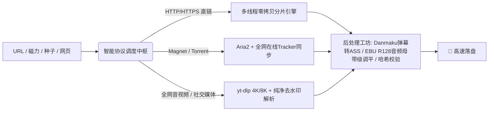

<div align="center">

# ⚡ Universal Downloader (全能下载器)
### *Next-Gen Liquid Glass Multi-Protocol Media & Stream Workstation*

[](https://github.com)
[](https://github.com)
[](LICENSE)
[](https://github.com)
[](https://github.com)

<p align="center">
  <b>🌐 零拷贝高并发分片 · 🧲 BitTorrent/磁力雷达 · 🎬 4K/8K音视频嗅探 · 🚫 100%全网社交媒体纯净无水印 · 🔮 桌面悬浮测速球 · 📱 局域网无线扫码投递</b>
</p>

[English](./README_EN.md) · [简体中文](./README.md) · [下载体验](https://github.com) · [商务合作与定制](#-商务定制与作者直联)

---

</div>

## 🌟 为什么选择全能下载器？(Highlights)

**Universal Downloader** 是一款专为极致性能与极简美学打造的现代化全协议下载与媒体工作站。融合 Apple Liquid Glass 流体玻璃视觉设计与工业级多核引擎（Aria2 + yt-dlp + FFmpeg），彻底颠覆传统下载工具臃肿、弹窗、限速的糟糕体验。



---

## 🚀 核心神级功能矩阵

### 1. 🧲 BitTorrent / 磁力全息雷达
- **实时节点感知**：解析并展示实时连接节点数与做种数（`👥 节点: X · 🌱 做种: Y`）。
- **全网 Tracker 在线极速同步**：一键聚合 GitHub 全球最新活跃 Tracker 列表，彻底告别 0KB/s 磁力死种。

### 2. 🎬 100% 社交媒体纯净无水印解析
- **主流社交平台通杀**：支持 抖音、TikTok、Bilibili、YouTube (4K/8K HDR)、Twitter/X、Instagram、小红书、快手等。
- **直连原画源流**：提取 CDN 原始 `play_addr` 与无水印高码率母盘视频。

### 3. 🔊 Danmaku 弹幕转 ASS & EBU R128 音频母带级调平
- **弹幕伴生转换**：自动将 B站/YouTube 弹幕转换为多轨道彩色滚动 ASS 字幕，与视频同名自动挂载。
- **广播级音量均衡**：内置 FFmpeg `loudnorm=I=-16:TP=-1.5:LRA=11` 算法，消除视频忽大忽小的爆音现象。

### 4. 🔮 桌面悬浮测速球 & 快捷托盘
- **极光流体呼吸测速球**：实时监测全局下载速率与活跃任务。
- **右键全局快捷菜单**：一键粘贴链接入队、一键全部暂停/继续、隐藏呼出。

### 5. 📱 手机局域网扫码无线投递
- **100% 真实标准二维码引擎**：手机微信或相机扫一扫，无需安装 App，即可在同一 Wi-Fi 下将手机端视频链接无线投递至电脑端高速下载。

### 6. 🔐 工业级多算法文件校验中心
- **三合一哈希计算**：极速流式计算 MD5、SHA-1、SHA-256，内置实时交互比对防篡改校验。

---

## 🖥️ 视觉与交互预览

<div align="center">
  
</div>

---

## 📦 快速下载体验

| 发行版本 | 格式 | 说明 | 下载直达 |
| :--- | :--- | :--- | :--- |
| **Windows 独立安装版** | `.exe (NSIS)` | 一键安装，自动关联磁力与种子协议 | [📥 点击下载 Setup.exe](https://github.com) |
| **Windows 绿色免安装版** | `.zip / .exe` | 解压即用，纯净便携 | [📥 点击下载 Portable.zip](https://github.com) |
| **macOS / Linux** | `.dmg / .AppImage` | 跨平台支持包 | [📥 点击查看 Releases](https://github.com) |

---

## 🛠️ 开发者从源码构建

```bash
# 1. 克隆代码仓库
git clone https://github.com/your-username/universal-downloader.git
cd universal-downloader

# 2. 安装依赖
npm install # 或 pnpm install

# 3. 本地启动热重载开发环境
npm run start

# 4. 构建 Windows 生产发布包
powershell -ExecutionPolicy Bypass -File .\build.ps1
```

---

## 💬 商务定制与作者直联

如果您有 **企业级批量下载部署、商业版本功能定制、专属流媒体协议逆向解析** 或技术交流合作需求，欢迎随时直联：

<div align="center">

| 渠道 | 联系方式 | 状态 | 快捷直达 |
| :---: | :---: | :---: | :---: |
| 🟢 **WhatsApp** | `+1 (249) 897-8869` | 实时在线 | [💬 发起 WhatsApp 聊天](https://wa.me/12498978869) |
| 🔵 **Telegram** | `@woeken318` | 实时在线 | [✈️ 发起 Telegram 聊天](https://t.me/woeken318) |
| 🔴 **Gmail 邮箱** | `songfx.shop318318@gmail.com` | 24h 内回复 | [📧 发送邮件](mailto:songfx.shop318318@gmail.com?subject=全能下载器商务合作与技术定制) |

</div>

---

## 🌟 Star History (点赞支持)

如果全能下载器为您带来了前所未有的下载与流媒体解析体验，请给我们点一个 ⭐️ **Star**！这是我们持续迭代的最大动力！

[](https://star-history.com/#woeken318/universal-downloader&Date)

---

## 📄 开源许可证
本项目基于 [MIT License](LICENSE) 开源。
