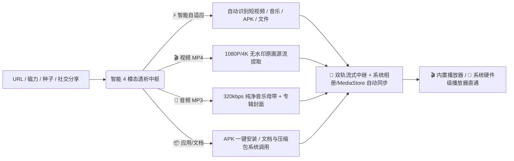

<div align="center">

# ⚡ Universal Downloader (全能下载器)
### *Next-Gen Liquid Glass Multi-Protocol Media & Stream Workstation*

[](https://github.com/WoeKen/Universal-Downloader/releases)
[](https://github.com/WoeKen/Universal-Downloader)
[-3DDC84.svg?style=for-the-badge&logo=android&logoColor=white)](https://github.com/WoeKen/Universal-Downloader/releases)
[](LICENSE)
[](https://github.com/WoeKen/Universal-Downloader/stargazers)

<p align="center">
  <b>🌐 4 模态自由透析 · 🎬 4K/8K 无水印原画 · 🎵 320kbps 音频提取 · 📦 APK/全文件通用下载 · 📱 双轨流式播放器 · 🧲 BitTorrent/磁力雷达</b>
</p>

[简体中文](./README.md) · [📥 下载 Windows / Android v1.2.0 最新版](https://github.com/WoeKen/Universal-Downloader/releases) · [💬 商务合作与定制](#-商务定制与作者直联)

---

</div>

## 🌟 为什么选择全能下载器？(Highlights)

**Universal Downloader (全能下载器)** 是一款专为极致性能与极简美学打造的跨平台现代化全协议下载与媒体工作站。
- **💻 Windows 端**：融合 Apple Liquid Glass 流体玻璃设计与工业级多核引擎（Aria2 + yt-dlp + FFmpeg），彻底颠覆传统工具臃肿、弹窗、限速的糟糕体验；
- **📱 Android 原生端 (v1.2.0)**：全新升级 **4 模态自由透析引擎**、**双轨流式播放器（攻克 Chromium 沙盒限制）**、**全功能底栏 4 舱联动** 与 **全格式通用下载支持（APK/音视频/文档/压缩包）**。



---

## 🚀 核心神级功能矩阵 (v1.2.0)

### 1. ⚡ 4 模态自由透析引擎 (New in v1.2.0)
- **⚡ 智能自适应**：自动根据链接类型或目标内容判断最佳下载策略；
- **🎬 视频 (MP4)**：强制解析提取最高画质（1080P/4K）无水印视频源流，杜绝压缩；
- **🎵 音频 (MP3)**：单曲/原声智能抽取，提取 320kbps 高保真音频并自动挂载原版封面；
- **📦 应用/文件 (APK/Doc)**：全格式通用支持，智能解析 Content-Disposition 文件名与 MIME 类型，下载后支持一键唤起系统 APK 安装器或关联第三方 App。

### 2. 🎬 双轨混合流式播放器 & 硬件解码直通 (New in v1.2.0)
- **原生虚拟流式中继服务**：彻底解决 Android Chromium WebView `file://` 沙盒跨域拦截问题，本地媒体秒开秒播；
- **系统硬件播放器直通**：内置 **【🎬 系统播放器】** / **【🎵 系统音乐】** 一键直通按钮，调用系统底层硬件硬解，支持 HDR、杜比全景声、画中画（PiP）及后台熄屏播放。

### 3. 📱 移动端悬浮底栏 4 舱全功能联动 (New in v1.2.0)
- **📋 任务中心**：实时下载队列监控与平滑动态速度波形图；
- **📡 无线投递**：局域网跨设备直连快传面板，手机/电脑扫码免安装秒传；
- **💬 联系作者**：官方 WhatsApp / Telegram / Gmail 实时沟通直连与动态二维码；
- **⚙️ 设置与偏好**：默认存储路径管理、相册自动入库开关、多线程并发调节（4~32线程）、一键缓存极速释放。

### 4. 🧲 BitTorrent / 磁力全息雷达 (PC & Mobile)
- **实时节点感知**：解析并展示实时连接节点数与做种数（`👥 节点: X · 🌱 做种: Y`）。
- **全网 Tracker 在线极速同步**：一键聚合 GitHub 全球最新活跃 Tracker 列表，彻底告别 0KB/s 磁力死种。

### 5. 🔊 Danmaku 弹幕转 ASS & EBU R128 音频母带级调平
- **弹幕伴生转换**：自动将 B站/YouTube 弹幕转换为多轨道彩色滚动 ASS 字幕，与视频同名自动挂载。
- **广播级音量均衡**：内置 FFmpeg `loudnorm=I=-16:TP=-1.5:LRA=11` 算法，消除视频忽大忽小的爆音现象。

### 6. 🔮 桌面悬浮测速球 & 快捷托盘 (PC)
- **极光流体呼吸测速球**：实时监测全局下载速率与活跃任务。
- **右键全局快捷菜单**：一键粘贴链接入队、一键全部暂停/继续、隐藏呼出。

---

## 📦 快速下载体验 (v1.2.0 正式版)

| 发行版本 | 格式 | 说明 | 下载直达 |
| :--- | :--- | :--- | :--- |
| **Android 原生独立版 (v1.2.0)** | `.apk` (6.45 MB) | 支持 4 模态透析、底栏 4 舱联动、系统相册入库、硬件播放直通 | [📥 下载 Universal-Downloader-v1.2.0-Android.apk](https://github.com/WoeKen/Universal-Downloader/releases/download/v1.2.0/Universal-Downloader-v1.2.0-Android.apk) |
| **Windows 独立安装版 (v1.2.0)** | `.exe (NSIS)` (74.99 MB) | 一键安装，全协议支持，自动关联磁力与种子协议 | [📥 下载 Universal-Downloader-Setup-1.2.0.exe](https://github.com/WoeKen/Universal-Downloader/releases/download/v1.2.0/Universal-Downloader-Setup-1.2.0.exe) |
| **Windows 绿色便携版 (v1.2.0)** | `.zip` (109.26 MB) | 解压即用，纯净无残留 | [📥 下载 Windows-Portable.zip](https://github.com/WoeKen/Universal-Downloader/releases/download/v1.2.0/Universal-Downloader-v1.1.9-Windows-Portable.zip) |

---

## 🛠️ 开发者从源码构建

```bash
# 1. 克隆代码仓库
git clone https://github.com/WoeKen/Universal-Downloader.git
cd Universal-Downloader

# 2. 安装依赖
npm install

# 3. 本地启动热重载开发环境
npm run start

# 4. 构建 Windows 生产发布包
powershell -ExecutionPolicy Bypass -File .\build.ps1
```

---

## 💬 商务定制与作者直联

如果您有 **企业级批量下载部署、商业版本功能定制、专属流媒体协议逆向解析** 或技术交流合作需求，欢迎随时直联：

<div align="center">

| 渠道 | 联系方式 | 状态 | 快捷直达 |
| :---: | :---: | :---: | :---: |
| 🟢 **WhatsApp** | `+1 (249) 897-8869` | 实时在线 | [💬 发起 WhatsApp 聊天](https://wa.me/12498978869) |
| 🔵 **Telegram** | `@woeken318` | 实时在线 | [✈️ 发起 Telegram 聊天](https://t.me/woeken318) |
| 🔴 **Gmail 邮箱** | `songfx.shop318318@gmail.com` | 24h 内回复 | [📧 发送邮件](mailto:songfx.shop318318@gmail.com?subject=全能下载器商务合作与技术定制) |

</div>

---

## 🌟 Star History (点赞支持)

如果全能下载器为您带来了前所未有的下载与流媒体解析体验，请给我们点一个 ⭐️ **Star**！这是我们持续迭代的最大动力！

[](https://star-history.com/#WoeKen/Universal-Downloader&Date)

---

## 📄 开源许可证
本项目基于 [MIT License](LICENSE) 开源。
